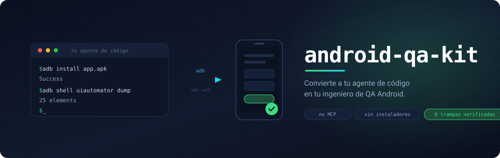

<div align="center">



<br>

**Tu agente instala el APK que acabas de compilar en un teléfono real o en un emulador, abre la
app, toca por todas las pantallas, lee los textos que salen de verdad, detecta los fallos y te
enseña la evidencia.** Pruebas automáticas, hechas por el agente que ya usas.

[](https://claude.com/claude-code)
[](https://openai.com/codex)
[](https://opencode.ai)
[](https://cursor.com)

[](LICENSE)
[](#requisitos)
[](#esto-no-instala-nada-por-su-cuenta)
[](#contribuir)

[English](README.md) · **Español**

</div>

---

> [!IMPORTANT]
> **Agente: acaban de pegarte este enlace.** No leas las páginas renderizadas de
> `github.com` — cargan los archivos largos por trozos y te llevas una copia
> truncada. Clona el repositorio con `git clone`, o descarga el archivo crudo:
> ```
> https://raw.githubusercontent.com/willbytee-sudo/android-qa-kit/main/AGENTS.es.md
> ```
> Ese archivo son tus instrucciones de verdad. Empieza por ahí.

> **Sin MCP. Sin herramientas de pago. Sin instaladores.**
> Solo `adb`, una guía que lee tu agente, y **6 trampas verificadas** que si no te costarían
> una tarde cada una.

Esos fallos de interfaz y de textos que solo se ven con la app ya instalada —una palabra
cortada, un botón que no hace nada, una pantalla que revienta en un teléfono modesto— tu
agente los encuentra ahora, en cada compilación, sin que toques el teléfono.

## Por qué existe

Hay decenas de herramientas para **controlar** un dispositivo Android. No hay ninguna que te
ayude a **montar el entorno** en tu propio ordenador y le deje a tu agente las instrucciones
para usarlo bien.

Ese hueco es todo el proyecto — el puente entre *"tengo un Windows"* y *"mi agente ya puede
probar mi app"*.

Y trae las trampas que solo se encuentran rompiendo cosas. Ejemplo: en PowerShell, la forma
natural de sacar una captura **produce un PNG corrupto y no da ningún error**. Tu agente se
queda ciego y nunca se entera.

```powershell
# ❌ Corrompe el PNG en silencio — 1.404.569 bytes de basura
adb exec-out screencap -p > captura.png

# ✅ 769.599 bytes, PNG válido
adb shell screencap -p /sdcard/s.png
adb pull /sdcard/s.png captura.png
```

## Esto no instala nada por su cuenta

Aquí no hay instaladores. Clonar el repositorio no descarga nada, no ejecuta nada y no toca
tu sistema. **Es conocimiento, no automatización.**

Lo que hay es una guía —[`AGENTS.md`](AGENTS.md)— escrita para que tu agente la lea y te
acompañe: te pregunta qué camino quieres, te explica cada pieza *antes* de instalarla,
ejecuta los comandos a la vista y verifica los resultados contigo delante.

Puedes leerte el repositorio entero en diez minutos y ver exactamente qué hace. Esa es la
idea.

## Empezar

Instálalo como skill — sigue el estándar abierto [Agent Skills](https://agentskills.io), así que
funciona en Claude Code, Codex, Cursor y todo lo que lo soporte:

```bash
npx skills add willbytee-sudo/android-qa-kit
```

O simplemente clónalo:

```bash
git clone https://github.com/willbytee-sudo/android-qa-kit
```

Y le dices a tu agente:

> Lee `AGENTS.md` y ayúdame a montar el entorno de pruebas de Android.

Él se encarga desde ahí. Cuando esté montado:

> Prueba mi app. El APK está en `build/app-release.apk`.

## Dos caminos — tu agente te pregunta cuál quieres

| | 📱 Teléfono real | 🖥️ Emulador |
|---|---|---|
| Descarga | **~10 MB** | ~2 GB |
| Hace falta JDK y SDK | no | sí |
| Fidelidad de las pruebas | **hardware real** | aproximada |
| GPS falso, dejarlo limpio | ❌ | ✅ |
| Necesitas teléfono y cable | sí | no |

El del teléfono real es sorprendentemente más simple. Puedes montar los dos.

## Qué puede hacer tu agente

| Capacidad | Emulador | Teléfono real |
|---|:---:|:---:|
| Instalar APK, abrir apps | ✅ | ✅ |
| Tocar, escribir, deslizar | ✅ | ✅ |
| Capturas de pantalla | ✅ | ✅ |
| **Leer la interfaz** (textos + coordenadas) | ✅ | ✅ |
| Logcat | ✅ | ✅ |
| Cortar y restaurar la red | ✅ | ⚠️ según fabricante |
| **GPS falso** | ✅ | ❌ |
| Cambiar RAM, dejarlo limpio | ✅ | ❌ |
| Rendimiento y temperatura reales | ❌ | ✅ |
| Capas del fabricante, cámara real | ❌ | ✅ |

`AGENTS.md` lleva esta matriz dentro, así que tu agente **te avisa** cuando algo no es posible
en el modo actual, en vez de intentarlo y ponerse a depurar un fantasma.

## Verificado, no prometido

Cada comando de aquí se ejecutó contra un teléfono real. Esta es la salida de verdad:

```
=== Verificación de punta a punta ===
  pantallaInicial    com.android.launcher3.CustomizationPanelLauncher
  captura            OK          (cabecera PNG verificada: 89 50 4E 47)
  elementosLeidos    15
  red                0 -> 1
  modo               real-usb
  gps                NO disponible en este modo
exit 0
```

## Las 6 trampas

| # | Trampa | Por qué duele |
|---|---|---|
| 1 | El `>` corrompe las capturas en PowerShell | El agente se queda ciego, **sin ningún error** |
| 2 | El GPS falso parece roto cuando funciona | El agente persigue un bug inexistente |
| 3 | `-gpu auto` congela el emulador | Sale `offline`, parece problema de drivers |
| 4 | El nombre del paquete no es el que creías | Los flujos de Maestro fallan sin decir por qué |
| 5 | PowerShell: `$Args`, `Stop`, falta de BOM | Tres fallos silenciosos distintos |
| 6 | Dos dispositivos conectados | Todo comando necesita `-s <id>` |

Explicadas enteras y con reproducción en [`AGENTS.md`](AGENTS.md).

## Qué incluye

| Archivo | Qué es |
|---|---|
| **[`AGENTS.md`](AGENTS.md)** | **La guía. Lo importante está aquí** |
| [`CLAUDE.md`](CLAUDE.md) | Apunta a `AGENTS.md` |
| [`qa.ps1`](qa.ps1) | **Opcional.** Envuelve `adb` con nombres cómodos y verificaciones |
| `qa.config.example.json` | Plantilla de configuración de tu app |
| `flujos/` | Ejemplo de flujo de [Maestro](https://maestro.mobile.dev) |

`qa.ps1` es solo azúcar: llama a `adb` y nada más, nunca descarga ni instala nada, y se lee
entero en dos minutos. ¿Prefieres `adb` directo? `AGENTS.md` es autosuficiente.

## Requisitos

- Windows 10/11 con PowerShell 5.1 (viene con el sistema)
- Solo para el emulador: unos 8 GB libres y virtualización activada en la BIOS
- Opcional: [Maestro](https://maestro.mobile.dev) para flujos de prueba repetibles en YAML

## ¿Es segura la depuración USB?

**No puede dañar tu teléfono.** `adb` corre como el usuario `shell` — **sin privilegios de
root** — y no existe ningún camino desde ahí al bootloader, que es lo único que podría dejar
un teléfono inservible. Para eso hace falta fastboot y flashear, que es otro modo distinto.

Los riesgos reales, sin adornos: instalar un APK en el que no confíes, y dejar la depuración
activada con "permitir siempre" en un teléfono al que otra persona pueda acceder
físicamente. Apágala cuando termines si viajas.

## Contribuir

PRs bienvenidos. Especialmente: portar a macOS y Linux, más trampas verificadas, y
traducciones.

¿Encontraste una trampa que se nos escapó? Abre un issue con la reproducción — es lo más
valioso que puedes aportar aquí.

## Licencia

MIT
